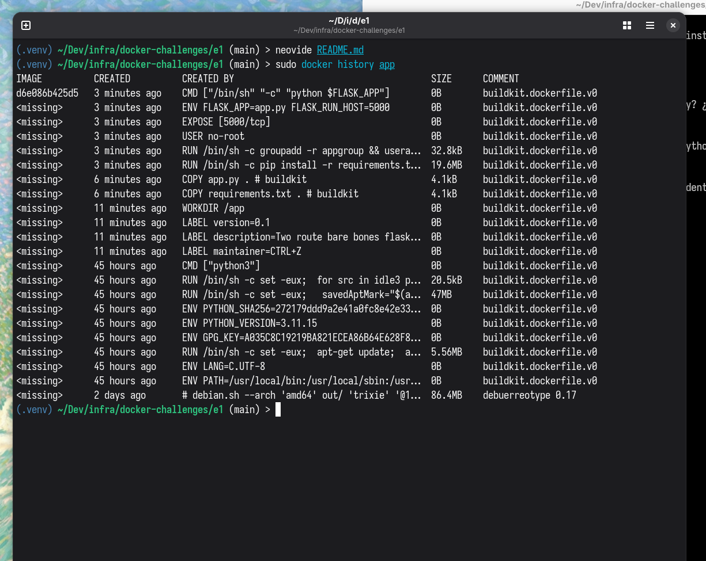

1. ¿Cuántas capas tiene la imagen resultante? ¿A qué instrucción del Dockerfile corresponde cada capa?

Al ejecutar el comando `docker history [nombre de la imagen]` nos muestra:

La imagen tiene 22 capas. En la columna "CREATED BY" muestra información de cada instrucción que corresponde a cada capa.

2. ¿Por qué se copia requirements.txt antes que app.py? ¿Qué efecto tiene esto en el caché de Docker?

Todo tiene que ver con las capas. Similar a las builds incrementales de los compiladores, `docker build` no recontruye todo cada vez que se ejecuta, en cambio solo reconstruye lo que es necesario. Si se coloca app.py antes que el requirements.txt, los requerimientos tendrían que ser "re-instalados" cada vez que se haga un cambio en app.py incluso si no se cambió ninguna dependencia.

3. ¿Qué diferencia hay en tamaño entre python:3.11, python:3.11-slim y python:3.11-alpine? ¿Cuál elegirías y por qué?

python:3.11 es la versión estándar de python, contiene las librerías más comunes y hasta librerías como Tkinter, que es una librerías gráfica, inútil para nuestro caso de uso, se estaría desperdiciando almacenamiento puesto que la imagen está basada en debian.
Por otro lado, python-slim es la versión oficial de python para docker que se ajusta a nuestro caso de uso, solo incluye los paquetes mínimos necesarios para que funcione.
python:3.11-alpine es una versión mucho más pequeña, como es de alphine Linux usa librerías más pequeñas en general (como musl lib en vez de gnu lib por ejemplo), sin embargo al ser muy liviana no contiene un administrador de paquetes como pip.

4. ¿Cuál es el riesgo de ejecutar procesos como root dentro de un contenedor?

Si la aplicación es vulnedara por ejemplo, un atacante tendría accesos privilagiados sobre los contenedores.

